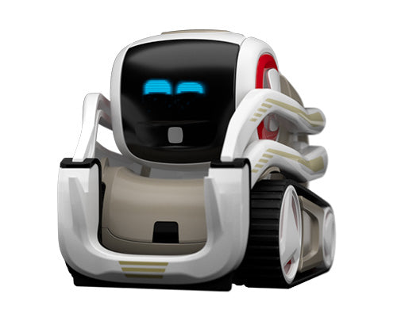
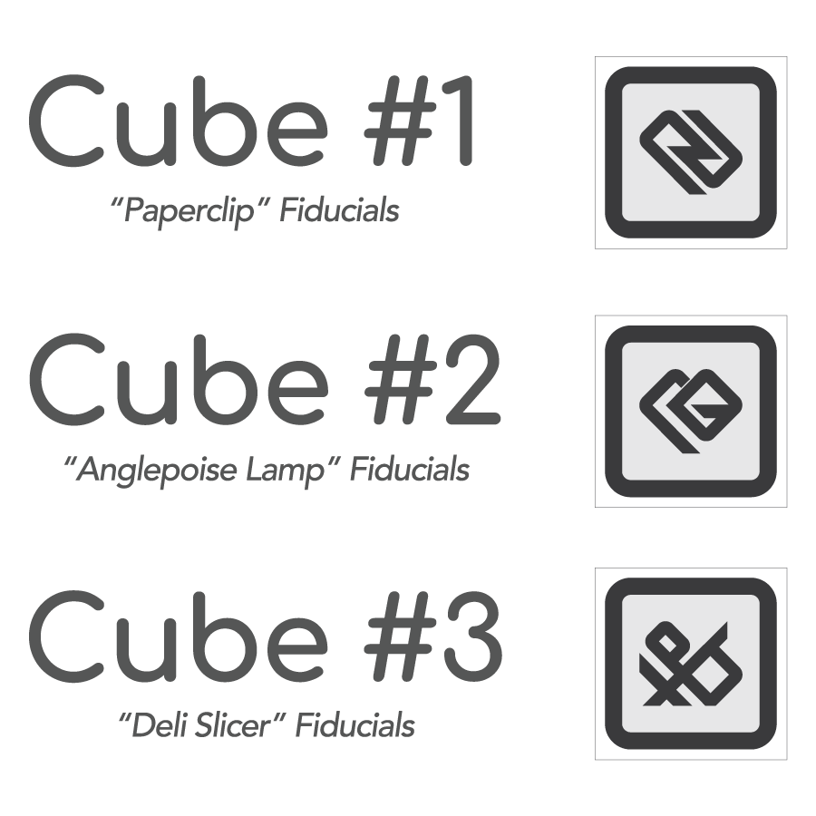

# Cozmo for Home Assistant

[](https://github.com/hacs/integration)
[](https://www.home-assistant.io/)
[](LICENSE)

Unofficial custom integration for the Anki / Digital Dream Labs **Cozmo** robot. Drive, camera, face, speech, lights, and light cubes from Home Assistant.



*Product photograph © Anki, Inc. Source: [anki.bot/products/cozmo-robot](https://anki.bot/products/cozmo-robot).*

**Not affiliated with Anki or Digital Dream Labs.** Cozmo’s Wi-Fi and protocol are handled by a small companion process built on [PyCozmo](https://github.com/zayfod/pycozmo). Use at your own risk.

**Author:** Filipe Lage  
**Developer:** Grok Code (xAI)

## What you need

- Home Assistant **2025.1** or newer
- A Cozmo robot with a charged battery
- A computer that can run the companion (Linux with NetworkManager is the tested path)
- A **second** Wi-Fi adapter dedicated to Cozmo. Do not use the interface that carries your normal network

Cozmo is not a device on your LAN. When you put it in SDK mode it starts its own access point. The name looks like `Cozmo_` plus the characters printed on the lift, and the password is printed there too. Only a station joined to that access point can reach the robot, which is always `172.31.1.1` UDP port `5551`.

## Install the integration

### HACS

1. Install [HACS](https://hacs.xyz/) if you do not have it yet.
2. **HACS → Integrations → ⋮ → Custom repositories**
   - Repository: `https://github.com/fclage/FCL.HA.CozmoAddon`
   - Category: **Integration**
3. Download **Cozmo** and restart Home Assistant.

### Manual

Copy `custom_components/ha_cozmo` to your Home Assistant config directory:

```text
<config>/custom_components/ha_cozmo/
```

Restart Home Assistant.

## Install the companion

The integration does not speak to Cozmo by itself. A companion process joins the robot’s access point and exposes `http://<host>:8790`.

On the machine that has the dedicated Wi-Fi adapter:

```bash
python3 -m venv .venv
.venv/bin/pip install -r companion/requirements.txt
.venv/bin/pycozmo_resources.py download
cp .env.example /etc/ha-cozmo-companion.env
# edit the SSID, password, and Wi-Fi interface
sudo install -m 600 /etc/ha-cozmo-companion.env /etc/ha-cozmo-companion.env
```

Run it in the foreground first:

```bash
set -a
source /etc/ha-cozmo-companion.env
set +a
.venv/bin/python -m companion
```

`GET http://127.0.0.1:8790/v1/health` should return OK. A systemd unit is in [`contrib/ha-cozmo-companion.service`](contrib/ha-cozmo-companion.service). The service user must be allowed to run `nmcli` (NetworkManager) without a password prompt, because joining an access point changes system network state.

Then in Home Assistant: **Settings → Devices & services → Add integration → Cozmo**.

| Field | What to enter |
| --- | --- |
| Companion URL | `http://127.0.0.1:8790` if the companion runs on the Home Assistant machine, otherwise `http://<companion-host>:8790` |
| Wi-Fi adapter | Interface name on the companion host, for example `wlan1`. Leave the companion to choose when you are unsure, but do not pick your normal uplink |
| SSID | The `Cozmo_…` name printed on the lift |
| Password | The password printed on the lift |

The password is stored in the Home Assistant config entry and in the companion environment file. Do not commit either.

Wi-Fi details, including why some USB adapters fail to associate, are in [docs/wifi.md](docs/wifi.md).

## Dashboard

A ready-made Lovelace view is in [`dashboards/cozmo.yaml`](dashboards/cozmo.yaml). It uses only built-in cards.

1. Open the dashboard you want, choose **Edit**, then the raw configuration editor.
2. Paste the view from that file into `views:`.
3. Save.

Entity ids assume the device is still named **Cozmo**. If you rename the device, update the ids to match.

An optional on-screen pad (short steps for the lift and head, and a text box that does not pull the page away) is `custom_cards/cozmo-pad.js`. Copy it to `<config>/www/cozmo-pad.js` and add a Lovelace resource:

- URL: `/local/cozmo-pad.js`
- Type: JavaScript module

Then you can use cards `custom:cozmo-pad` and `custom:cozmo-say`.

## What you can control

| Area | Entities and actions |
| --- | --- |
| Link | Connection, battery, charging, on charger, pose |
| Power | **Power off** plays the get-into-sleep animation, then shuts the body down. **Wake up** reconnects, opens the eyes, and raises the head without driving |
| Auto | After 30 seconds with no taps, small motions and expressions. Off means driving is remote-only. Faces still update |
| Auto-sleep | After 5 minutes with no taps, the same sleep-then-power-off sequence, including while docked |
| Camera | Still frames from the robot camera |
| Move | Wheel speeds, head angle, lift height |
| Face and reactions | Procedural expressions, named reactions, animation clips |
| Speech | Phrase ids or any text (espeak on the companion host) |
| Cubes | Seen cubes, one linked cube, battery level, tap, four LEDs each |

### Power on after shutdown

**Power off** turns the robot off. Its access point goes away, so Home Assistant cannot reach it until the robot is booted again.

1. Press the backpack button on the robot so it starts and the `Cozmo_…` network exists.
2. Press **Wake up** (or the **Power on** badge). The companion rejoins, connects, and raises the head. Wheels are not driven, including on the charger.

**Wake up**, **Auto**, and **Auto-sleep** stay available while the robot is off, as long as the companion process is running. **Power off** is available only while the robot is connected.



*Cube symbol chart © Anki, Inc.*

### Cubes

Cozmo can hear several light cubes, but this integration’s connect command uses a single radio slot. Connecting a second cube disconnects the one already linked. **Link cubes** therefore links one cube and will not send another connect while that slot is taken. Each cube still exposes a battery reading, a tap sensor (on for a few seconds after a tap), and four LED lights once it is the linked cube.

### Known limits

- One dedicated Wi-Fi adapter per robot.
- The companion keeps Cozmo off your default route (`ipv4.never-default`), so joining the robot must not take over your internet connection.
- Group cipher TKIP is part of Cozmo’s access point. Adapters that refuse TKIP will not associate. See [docs/wifi.md](docs/wifi.md).
- There is no microphone on the robot. Speech is outbound only.
- Animations need the PyCozmo asset download. Faces work without it.
- Wake from a full power-off needs the backpack button first.

## Privacy

Do not put the lift password, companion token, or a filled `.env` in git, issues, or diagnostics dumps. The integration’s diagnostics redacts `password`, `token`, and `psk`.

## Development

```bash
python3 -m venv .venv
.venv/bin/pip install pytest -r companion/requirements.txt
.venv/bin/pytest tests -q
```

## License

The source code in this repository is MIT. Copyright (c) 2026 Filipe Lage. See [LICENSE](LICENSE).

Cozmo®, the robot, the light cubes, the names, the product photographs, the artwork, and the related intellectual property are © Anki, Inc. They remain Anki’s property (and that of Anki’s successors). The pictures under `docs/images/` were taken from [anki.bot/products/cozmo-robot](https://anki.bot/products/cozmo-robot) only to identify the product. They are not part of the MIT license. See [docs/images/COPYRIGHT.md](docs/images/COPYRIGHT.md).

PyCozmo is a separate project: <https://github.com/zayfod/pycozmo>.
